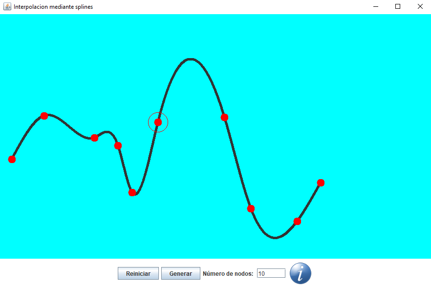

# Points interpolation 

**Program**: https://github.com/oscarjcg/splines/tree/master/Application
* **Windows**: Standalone
* **Linux**: java -jar Aplicacion.jar

**Description:** Points interpolation with a cubic spline

**Features**:
* 'A', 'D': Select point
* 'Up', 'Down', 'Left', 'Right': Move point
* MVC

**Development environment**:
* **OS:** Linux
* **Java:** 1.8.0_121  
* **Eclipse:** Neon